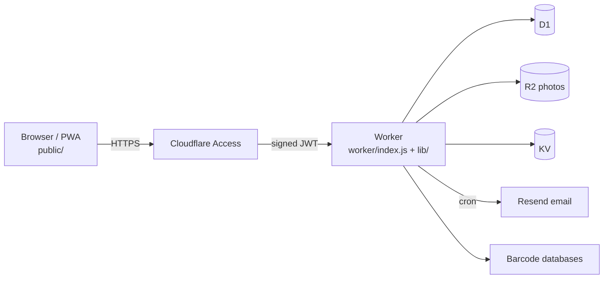

# Architecture

The Inventory Management System is a plain HTML, CSS and JavaScript web app (installable as a PWA) served by a Cloudflare Worker with D1 (data), R2 (photos) and KV (push keys), behind Cloudflare Access. People share inventory in **Shops** (called `household` in tables, routes and code). A local Node and SQLite server runs the same client for one household.

## Documents

| Document | Covers |
| --- | --- |
| [Overview and deployment](docs/architecture/overview.md) | System context, Cloudflare deployment, bindings and secrets, cron jobs, local mode |
| [Folder and module map](docs/architecture/modules.md) | What each folder and module in `public/`, `lib/`, `worker/`, `migrations/` and `test/` does |
| [Request lifecycle](docs/architecture/request-lifecycle.md) | Access JWT, account-scoped routes, tenant resolution with `X-Shop-Id`, cache policy |
| [Data model](docs/architecture/data-model.md) | ER diagrams from the migrations, retention |
| [Key flows](docs/architecture/flows.md) | Sign-in, offline edits and sync, barcode lookup, Shop types and lists, invitations, deletion and purge, email, admin |
| [Security model](docs/architecture/security.md) | Roles, Owner checks, request hardening, admin privacy, secrets |
| [Testing approach](docs/architecture/testing.md) | How the suites work and what they do not cover |
| [How to add a feature](docs/architecture/adding-a-feature.md) | Checklist: routes, migrations, the three asset lists, tests, documents |
| [Design records](docs/architecture/design-records.md) | Detailed per-feature designs and decisions (the former contents of this file) |

The pages above describe the system as built. When they and the design records disagree, the code and the pages above are current. Deployment steps are in [`deploy/cloudflare-workers.md`](deploy/cloudflare-workers.md); project status is in [`HANDOVER.md`](HANDOVER.md).
