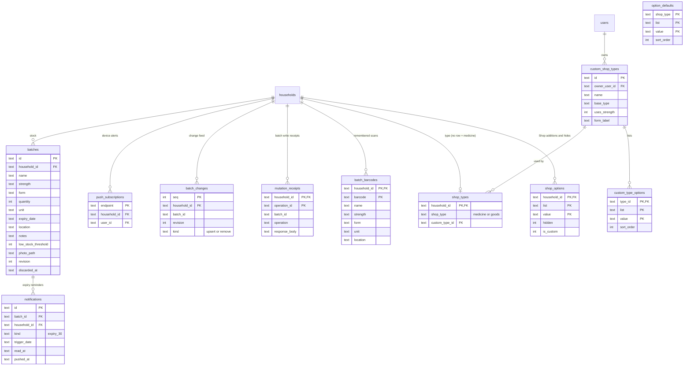

# Data model (D1)

The schema is the result of applying `migrations/0001` to `0032` in order. Internal names still say **household**; the product calls it a **Shop**. Renaming tables or columns would need a separate compatibility migration, so they stay as they are.

Times are ISO 8601 text. Ids are UUID text unless noted.

## Shops, people and access

```mermaid
erDiagram
  users ||--o{ identities : "signs in as"
  users ||--o{ memberships : has
  households ||--o{ memberships : has
  households ||--o| household_settings : "settings"
  households ||--o| household_deletions : "soft delete"
  households ||--o{ household_invitations : "pending invites"
  users ||--o{ household_invitations : "created by"
  users ||--o| user_shop_preferences : "last selected Shop"
  households ||--o{ user_shop_preferences : "chosen in"
  users ||--o| user_email_preferences : "email switches"
  households ||--o| tenant_bootstrap : "first Shop"
  households ||--o{ shop_feature_flags : "overrides"
  households ||--o{ access_audit : "history"

  users {
    text id PK
  }
  identities {
    text provider PK "cloudflare_access"
    text subject PK
    text user_id FK
    text email
  }
  households {
    text id PK
    text name
  }
  memberships {
    text household_id PK, FK
    text user_id PK, FK
    text role "owner or member"
  }
  household_settings {
    text household_id PK, FK
    text display_name
    text household_name
    text default_storage_location
    text display_name_source
  }
  household_deletions {
    text household_id PK, FK
    text deleted_at
    text purge_after
    text deleted_by_user_id FK
    text purged_at
  }
  household_invitations {
    text id PK
    text household_id FK
    text email
    text role "member or owner"
    text expires_at
  }
  user_shop_preferences {
    text user_id PK, FK
    text household_id FK
  }
  user_email_preferences {
    text user_id PK, FK
    int notices_enabled
    int digest_enabled
  }
  tenant_bootstrap {
    int singleton PK
    text household_id FK
    text owner_user_id FK
  }
  shop_feature_flags {
    text household_id PK, FK
    text flag PK
    int enabled
    text updated_by
  }
  access_audit {
    text id PK
    text event
    text household_id FK
    text actor_user_id FK
    text target_identifier
    text request_id
  }
```

- `active_memberships` (view, migration 0020) is `memberships` without Shops that have a `household_deletions` row. All readers use it; writes use `memberships`.
- `household_invitations` is unique per `(household_id, email)` and expires after seven days. Accepting deletes the row and writes an acceptance receipt.
- `tenant_bootstrap` is a one-row lock: the first Shop can be claimed once, by an address in `INITIAL_OWNER_EMAILS`.
- A purged Shop keeps its `households` row, renamed `(deleted Shop)`, so audit rows and receipts keep valid references.

## Inventory, lists and types

- `batches.revision` starts at 1 and increases on every change; a write with an older `baseRevision` gets 409 with the current batch.
- Every batch write appends a `batch_changes` row in the same D1 batch. `batch_change_floor` (one row) records the highest sequence removed by pruning; a client cursor below it gets `reset: true`.
- Every quantity change (add, use, edit, discard, CSV import) also appends a `stock_events` row right after the `batch_changes` row, with `WHERE changes()=1` so it only exists when the write did. It copies the item name and unit so history survives a rename. Rows are kept until the Shop is purged; the item dialog and Notifications read them through `GET /api/stock-events`.
- Lists are `form`, `unit`, `location` and `strength`. `option_defaults` holds platform defaults per built-in type; `custom_type_options` holds a custom type's lists; `shop_options` holds a Shop's own additions (`is_custom = 1`) and hidden defaults (`hidden = 1`).
- `shop_types.shop_type` always holds the base type, even when `custom_type_id` is set, so older code paths keep working.

## Email, receipts and operations

| Table | Purpose |
| --- | --- |
| `notification_outbox` | One row per email: `kind` (`invitation_created`, `shop_deleted`, `ownership_transferred`, `weekly_digest`), unique `dedupe_key`, `status` (`pending`, `sending`, `sent`, `cancelled`, `failed`, `uncertain`), attempts, lease and next attempt time |
| `shop_creation_receipts`, `shop_owner_promotion_receipts`, `shop_owner_demotion_receipts`, `shop_member_removal_receipts`, `shop_member_leave_receipts`, `shop_ownership_transfer_receipts`, `shop_deletion_receipts`, `household_invitation_acceptance_receipts` | Idempotency receipts keyed by operation id, so a retried request replays instead of acting twice. Pruned after the retention period |
| `household_invitation_route_throttle_events` | Rolling one-minute counters per hashed principal (and hashed IP for invitation routes): 30 pending reads, 10 acceptances, 60 change feed reads |
| `admin_audit` | Every admin read and write; writes carry `reason` and `operation_id` (unique per admin) |
| `profile_settings` | Legacy single-household settings table from migration 0003; the Worker does not read it |

Audit tables (`access_audit`, `admin_audit`) and deletion tombstones are never pruned.

## Retention summary

| Data | Kept for |
| --- | --- |
| `batch_changes`, `mutation_receipts` | 30 days |
| Other receipt tables | 90 days by default (`RECEIPT_RETENTION_DAYS`, minimum 30) |
| `notification_outbox` sent, cancelled or never attempted | 30 days; failed and uncertain rows stay for review |
| Deleted Shop data | Until the keep period (7 to 30 days) ends and the purge runs |
| `access_audit`, `admin_audit` | Not pruned |
