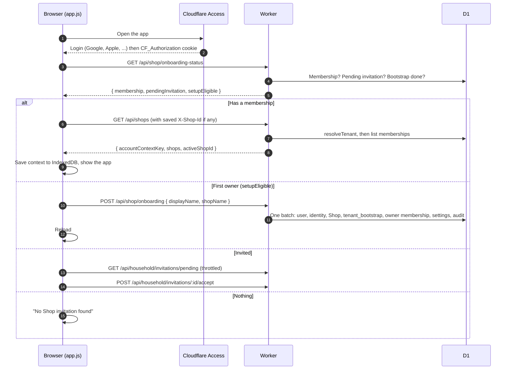
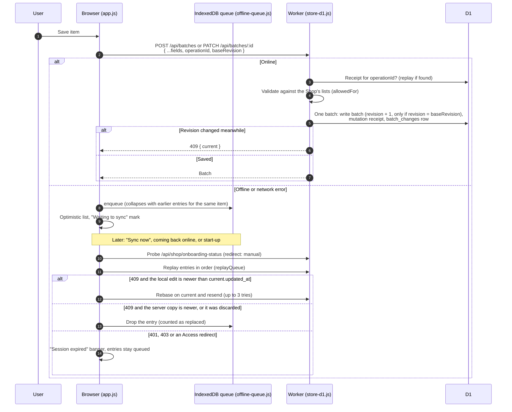
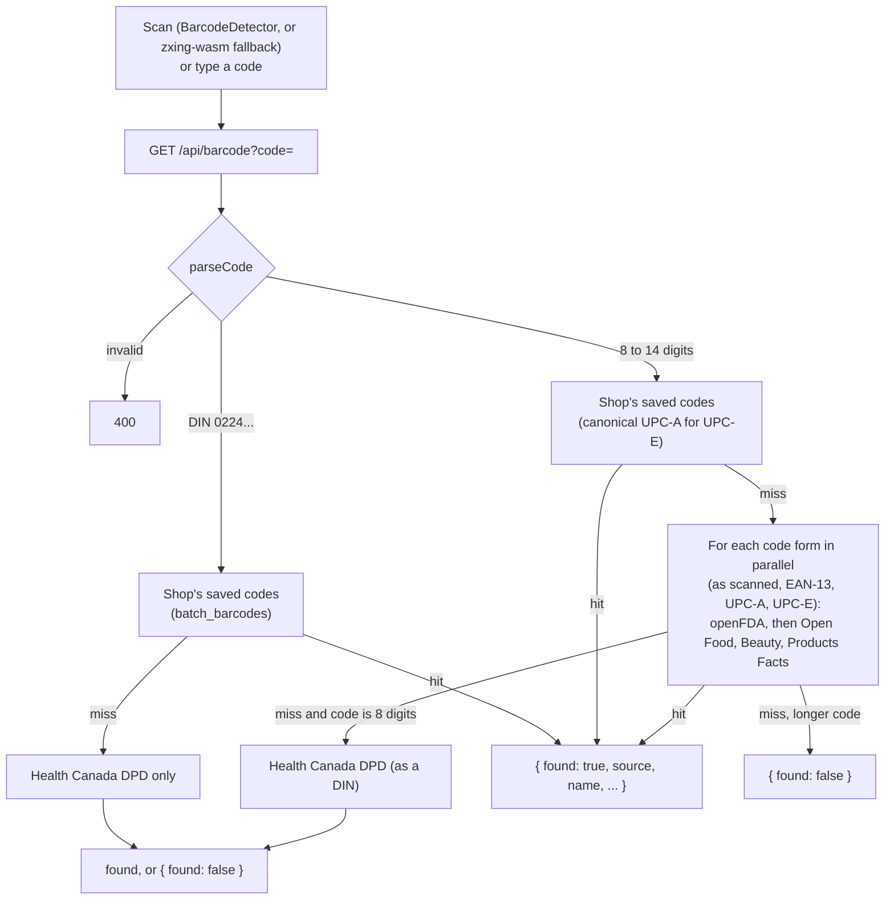
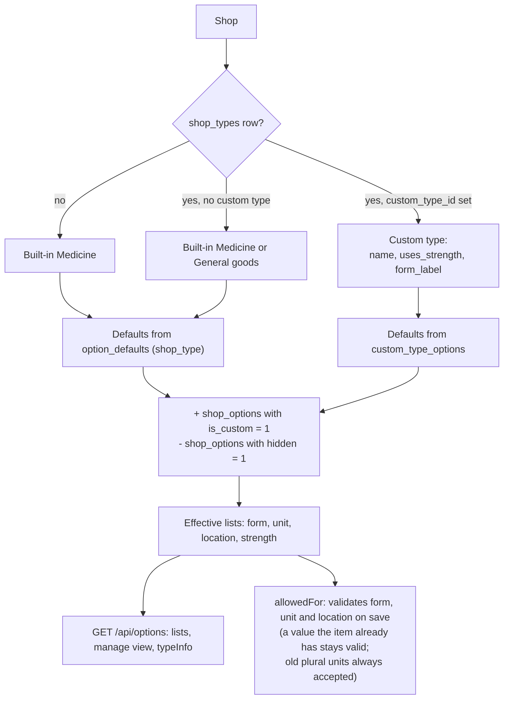
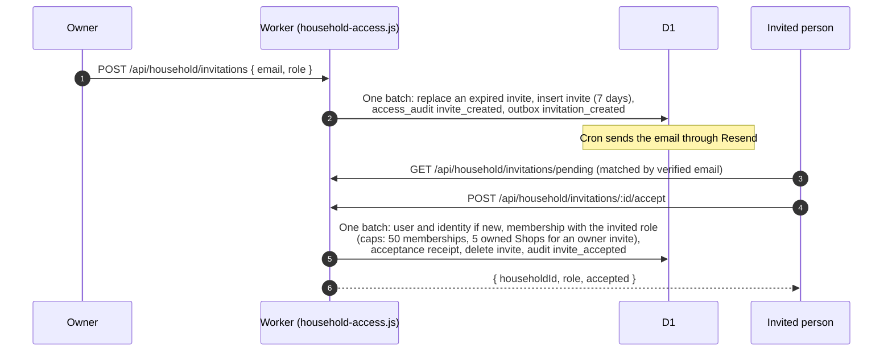
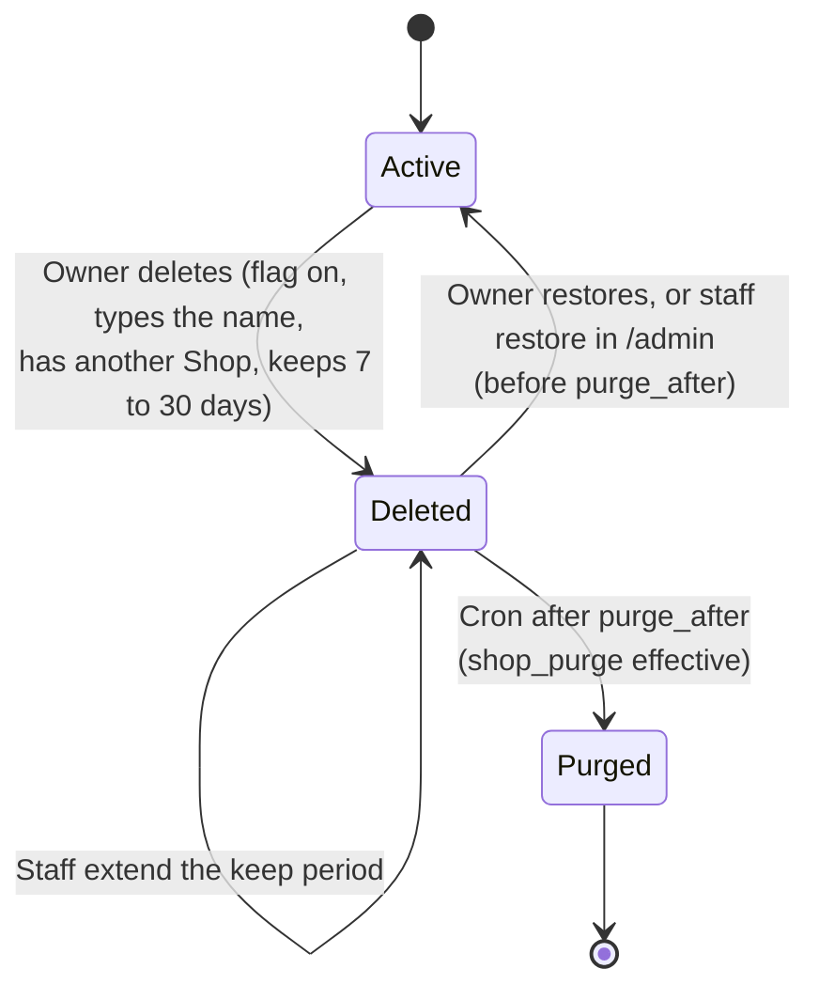
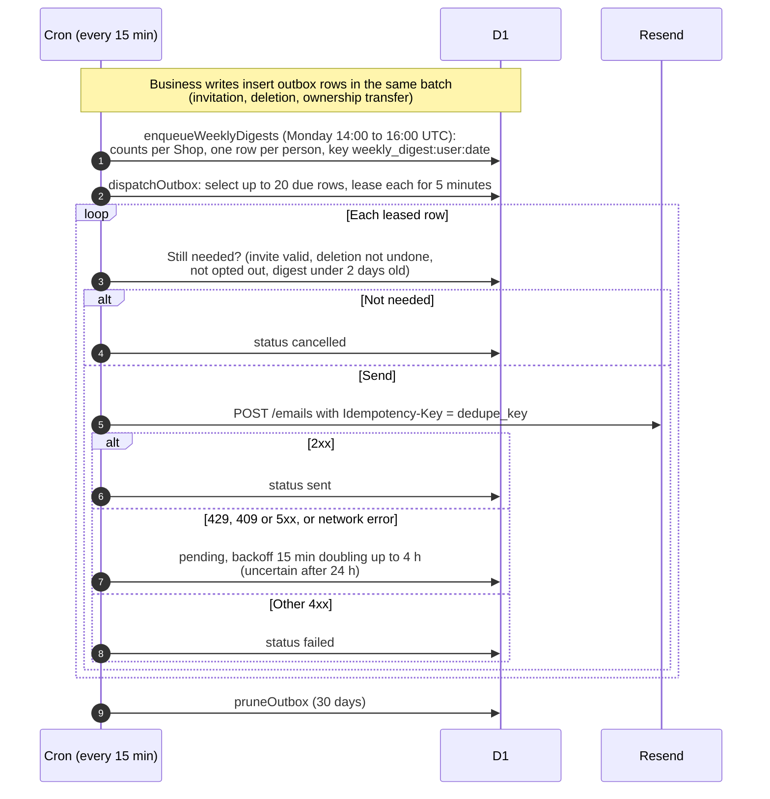
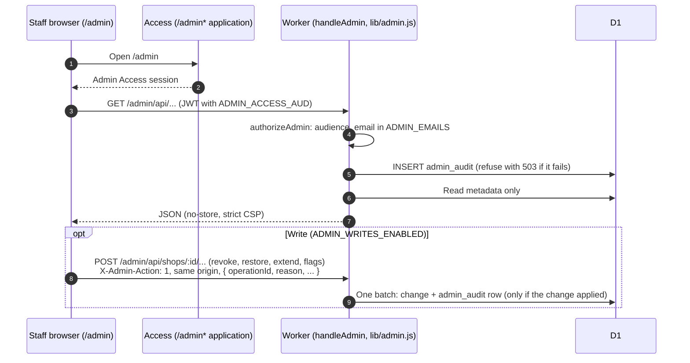

# Key flows

Each diagram follows the code paths named under it. Route handlers are in `worker/index.js`.

## 1. Sign-in and Shop selection

- Switching Shops: the browser confirms the new Shop with `GET /api/shops` and `X-Shop-Id` (which saves the preference), then reloads so no state from the old Shop remains (`shop-client.js`, `app.js`).
- If `/api/shop/onboarding-status` answers 404, the app runs in local single-household mode.
- If the network fails at start-up, `offlineBoot` shows the last saved snapshot of the Shop from IndexedDB.

## 2. Add or edit an item, with the offline queue

- New photos are written to R2 first; if the database write fails, the photo is removed.
- After a create that carries `barcode`, `rememberBarcode` saves the name and fields for that code in `batch_barcodes`.
- Other devices see the change through the change feed: `change-feed-client.js` polls `GET /api/changes?after=<seq>` about once a minute (with backoff and a full reload every 10 minutes as a safety net).

## 3. Barcode scan and lookup order

Each external call has a 4-second timeout and no API key. A miss is not an error: the app opens a blank Add form with the code attached, and saving it teaches the Shop's own lookup.

## 4. Shop type and list resolution

- Strength is suggestions only (free text) and may be emptied; the other lists must keep at least one option.
- Owners edit a Shop's lists (`POST /api/options`, `/hide`, `/remove`). Staff edit platform defaults in `/admin` (`ADMIN_WRITES_ENABLED`).
- Custom types (`lib/shop-types.js`) are private to the Owner who made them (at most 10), start as a copy of a built-in or another of their types, and cannot be deleted while a Shop uses them. Only the type's owner can assign it to a Shop; another Owner can still save the Shop's settings with the type unchanged.

## 5. Invitations and ownership

Owner actions on the pinned Shop (all need `X-Shop-Id`, an operation id for replay, and write an audit event):

| Action | Route | Rule |
| --- | --- | --- |
| Make owner | `POST /api/household/members/:id/promote` | Target is a Member of this Shop |
| Make member | `POST /api/household/members/:id/demote` | Target is another Owner; at least two Owners exist |
| Transfer ownership | `POST /api/household/members/:id/transfer` | Target Member becomes Owner, caller becomes Member; the new Owner gets an email |
| Remove member | `POST /api/household/members/:id/remove` | Target is a Member |
| Leave | `POST /api/household/leave` | Anyone except the last Owner |
| Revoke invitation | `DELETE /api/household/invitations/:id` | Owner of the Shop |

## 6. Shop deletion, restore and purge

- **Delete** (`POST /api/household/delete`): needs the effective `shop_deletion` flag (per-Shop override, else `SHOP_DELETION_ENABLED`). One batch writes the receipt, the `household_deletions` row, the audit event and `shop_deleted` emails to other members, and removes pending invitations and push subscriptions. `active_memberships` hides the Shop immediately.
- **Restore** (`POST /api/shops/:id/restore`, account-scoped): an Owner of the deleted Shop, inside the keep period, owning fewer than five active Shops. Staff use `POST /admin/api/shops/:id/restore` or `/extend` with a written reason.
- **Purge** (`purgeDeletedShops`): up to 5 Shops per run. A per-Shop `shop_purge` override wins; otherwise `SHOP_PURGE_ENABLED` decides, and without it the run only logs. Photos are deleted from R2 first; then one batch removes the Shop's rows (batches, notifications, change feed, mutation receipts, push subscriptions, invitations, settings, preferences, barcodes, lists, type, memberships), renames the Shop `(deleted Shop)`, sets `purged_at` and writes `shop_purged`.

## 7. Weekly digest and email outbox

Emails contain no item names. The digest has only counts per Shop. Without `RESEND_API_KEY`, `EMAIL_FROM` and an https `APP_URL`, dispatch does nothing and rows wait. Staff see queued, failed and uncertain rows in the admin **Email** tab.

## 8. Admin console

Tabs: Overview, Shops (type, members, roles, deletion state, flags, lists), Audit, Lists (platform defaults), Shop types, Email (outbox) and Admin log. Shop writes need a 10 to 500 character reason, are limited to 30 per admin per minute and replay safely by operation id. Platform list defaults are changed with `POST /admin/api/option-defaults`, which writes its `admin_audit` row before the change.
