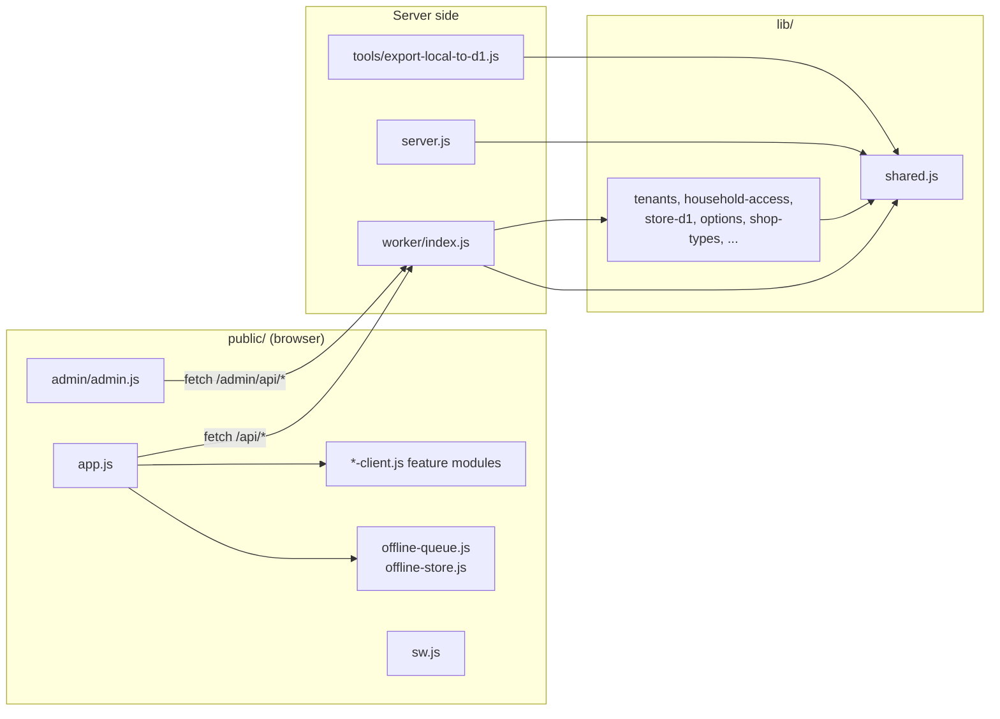

# Folder and module map

## Top level

| Path | What it is |
| --- | --- |
| `worker/index.js` | Cloudflare Worker entry: routing, Access check, admin console, cron jobs |
| `server.js` | Local single-household Node server (SQLite, no Shops) |
| `lib/` | Server logic shared by the Worker, the local server, tools and tests |
| `public/` | Browser client (plain HTML, CSS and ES modules, no build step), service worker, admin console |
| `migrations/` | D1 SQL migrations, applied in file-name order (there is no `0002`) |
| `test/` | `node --test` suites (`*.test.js`) plus the shared fixture `deletion-stub.js` |
| `tools/export-local-to-d1.js` | Offline converter from a local SQLite database to a D1 import |
| `docs/deployment.md` | Production setup and deploy steps |
| `docs/` | Architecture, process and history documents (see [`docs/README.md`](../README.md)) |
| `wrangler.toml` | Worker name, bindings, routes, cron and plain variables |

## How the pieces depend on each other

## `lib/` (server modules)

| Module | Responsibility |
| --- | --- |
| `shared.js` | Batch validation and status, Access JWT verification, VAPID and web push, photo parsing, vision suggestions, `publicAssetPaths` allowlist |
| `tenants.js` | Tenant resolution (`resolveTenant`, `pinnedTenant`), Shop list and context, first Shop setup, creating another Shop |
| `household-access.js` | Invitations (create, list pending, accept, revoke), promote, demote, transfer, remove, leave, delete a Shop, invitation route throttle |
| `store-d1.js` | Shop-scoped inventory store on D1: settings, batches with revisions and receipts, photos in R2, reminders, push delivery |
| `batch-changes.js` | Change feed reads (`GET /api/changes`) and pruning |
| `options.js` | Shop type reference, dropdown list resolution, Shop list edits, platform defaults |
| `shop-types.js` | Owner-defined custom Shop types |
| `barcode.js` | Barcode and DIN parsing, lookup order, remembering saved codes |
| `deleted-shops.js` | Owner's list of deleted Shops and self-service restore |
| `shop-purge.js` | Permanent purge after the keep period |
| `feature-flags.js` | Flag registry and per-Shop overrides |
| `email-outbox.js` | Outbox insert statements, rendering, dispatch through Resend, pruning |
| `email-preferences.js` | Per-person email switches |
| `digest.js` | Weekly summary email queueing |
| `overview.js` | Owner overview across owned Shops and its CSV |
| `export.js` | Current Shop CSV export with formula neutralizing |
| `retention.js` | Receipt retention pruning |
| `admin.js` | Admin authorization, admin audit, read views and audited write actions |

## `public/` (browser modules)

| Module | Responsibility |
| --- | --- |
| `index.html`, `styles.css` | App shell and styles |
| `app.js` | Start-up gates, views, forms, offline banner and sync, wiring of every feature module |
| `shop-client.js` | `requestShopApi` (adds `X-Shop-Id` to Shop-scoped calls), Shop switching helpers, photo loader |
| `shop-creation-client.js` | Create another Shop dialog |
| `shop-invitations-client.js` | Invitations sent to you (Profile card and join dialog) |
| `owner-promotion-client.js`, `owner-demotion-client.js`, `ownership-transfer-client.js`, `member-removal-client.js`, `shop-leave-client.js` | Role and membership actions in Profile |
| `shop-deletion-client.js`, `deleted-shops-client.js` | Delete this Shop; Recently deleted Shops with restore |
| `options-client.js` | Shop dropdown lists, type wording, Owner list editor |
| `shop-types-client.js` | Manage Shop types dialog and type selects |
| `barcode-client.js`, `zxing-detector.js` | Scanner dialog; fallback decoder using `vendor/zxing-reader.iife.js` and `vendor/zxing_reader.wasm` |
| `change-feed-client.js` | Polls `GET /api/changes` about once a minute while open |
| `offline-store.js` | IndexedDB `medicine-offline`: last context, list snapshots, queued changes |
| `offline-queue.js` | Pure rules for the offline change queue and its replay |
| `restock-client.js` | Restock list |
| `overview-client.js` | Owner overview, printable report and CSV |
| `inventory-export-client.js` | Current Shop CSV download |
| `email-preferences-client.js` | Email switches in Profile |
| `profile-tabs.js`, `info-tips.js`, `greeting.js` | Profile tabs, field help tips, time-of-day greeting |
| `sw.js` | Service worker: network-first app shell cache and push notifications |
| `admin/index.html`, `admin/admin.js`, `admin/admin.css` | Admin console (served only through the admin route) |

## `migrations/`

Each file is one additive step. Several rebuild a table to widen a `CHECK` constraint (for example `access_audit` events, outbox kinds, option lists) and copy every row with a count guard. See [data-model.md](data-model.md) for the resulting schema.

## `test/`

One file per feature or risk. See [testing.md](testing.md).
