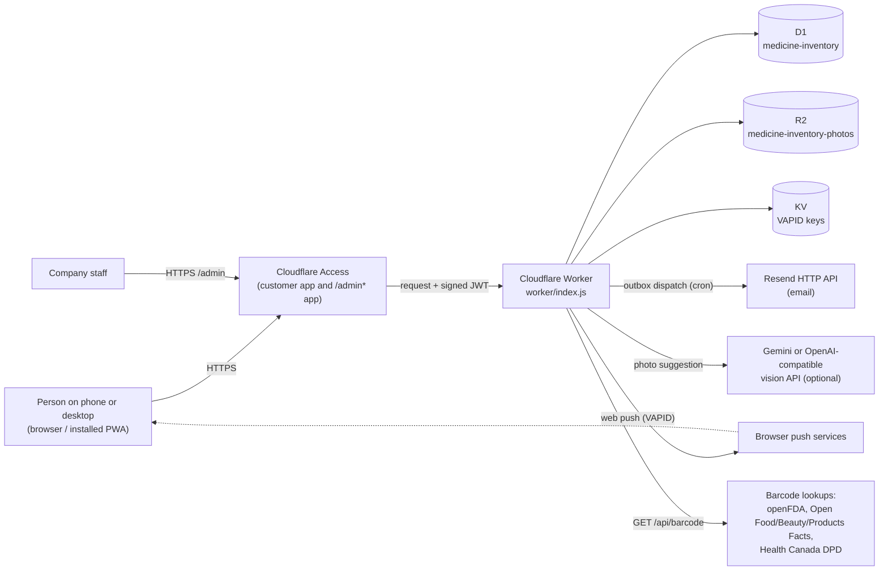
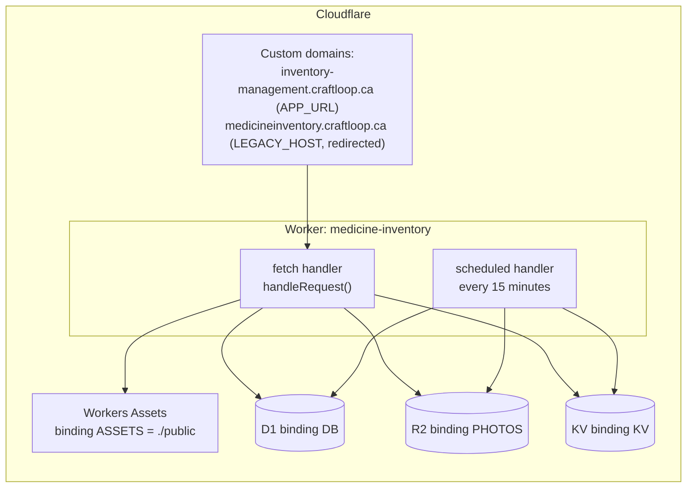

# System overview and deployment

The Inventory Management System runs in two modes from one code base:

- **Cloud (production):** a Cloudflare Worker (`worker/index.js`) with D1, R2 and KV, behind Cloudflare Access. People share one or more Shops.
- **Local:** a Node HTTP server (`server.js`) with SQLite (`node:sqlite`) and photo files under `data/`. One household, no Shops, no sign-in, bound to `127.0.0.1` by default.

The browser client in `public/` is the same in both modes. When a cloud-only route answers 404 (local mode), the client falls back to the single-household experience.

## System context

## Deployment

Configuration lives in `wrangler.toml` (names, bindings, routes, cron, plain variables). `run_worker_first = true`, so every request, including static files, goes through `handleRequest`.

| Kind | Name | Purpose |
| --- | --- | --- |
| Variable | `APP_URL` | Canonical address used in emails and as the redirect target |
| Variable | `LEGACY_HOST` | Old hostname; requests to it get 301 (GET/HEAD) or 308 to `APP_URL` |
| Variable | `EMAIL_FROM`, `PUSH_CONTACT` | Email sender and VAPID contact |
| Secret | `ACCESS_TEAM_DOMAIN`, `ACCESS_AUD` | Customer Access JWT issuer and audience (required; missing means 503) |
| Secret | `INITIAL_OWNER_EMAILS` | One-time bootstrap allowlist for the first Shop |
| Secret | `ADMIN_ACCESS_AUD`, `ADMIN_EMAILS` | Admin Access audience and staff allowlist (missing means the console returns 503) |
| Secret | `RESEND_API_KEY` | Email delivery; without it the outbox rows wait |
| Secret | `GEMINI_API_KEY` / `VISION_API_KEY` | Optional photo suggestions |
| Flag secret | `ADMIN_WRITES_ENABLED` | Allows admin write actions (global only) |
| Flag secret | `SHOP_DELETION_ENABLED`, `SHOP_PURGE_ENABLED` | Global defaults; a per-Shop override in `shop_feature_flags` wins |
| Optional | `RECEIPT_RETENTION_DAYS` | Receipt retention (default 90, minimum 30) |

Step-by-step setup and deploy commands are in [`docs/deployment.md`](../deployment.md).

## Scheduled work (cron, every 15 minutes)

The `scheduled` handler in `worker/index.js` runs these jobs in parallel. Each job except push delivery catches its own errors, so one failure does not stop the others.

| Job | Code | What it does |
| --- | --- | --- |
| Expiry pushes | `deliverScheduledPushes` | For each Shop, refreshes 30-day expiry reminders and pushes unsent ones to subscribed browsers |
| Change feed pruning | `pruneBatchChanges` (`lib/batch-changes.js`) | Removes change feed rows older than 30 days |
| Receipt pruning | `pruneReceipts` (`lib/retention.js`) | Removes idempotency receipts older than the retention period, 500 rows per table per run |
| Weekly digest | `enqueueWeeklyDigests` (`lib/digest.js`) | On Monday 14:00 to 16:00 UTC, queues one summary email per person |
| Email dispatch | `dispatchOutbox` (`lib/email-outbox.js`) | Leases up to 20 due outbox rows and sends them through Resend |
| Outbox pruning | `pruneOutbox` | Removes sent, cancelled and never-attempted rows after 30 days |
| Shop purge | `purgeDeletedShops` (`lib/shop-purge.js`) | Purges up to 5 deleted Shops whose keep period ended; a dry run unless enabled |

## Local mode differences

| Area | Cloud | Local |
| --- | --- | --- |
| Storage | D1, R2, KV | `data/inventory.sqlite`, `data/photos/`, `data/vapid.json` |
| Sign-in | Cloudflare Access JWT (required) | None by default; Access checks run only if `ACCESS_TEAM_DOMAIN` and `ACCESS_AUD` are set |
| Shops, roles, invitations, admin | Yes | No (routes return 404, the client hides those features) |
| Push timer | Worker cron | `setInterval` every `PUSH_INTERVAL_MS` (default 15 minutes) |

`tools/export-local-to-d1.js` converts a local SQLite database into a D1 SQL file and an R2 upload script. It never contacts Cloudflare.
