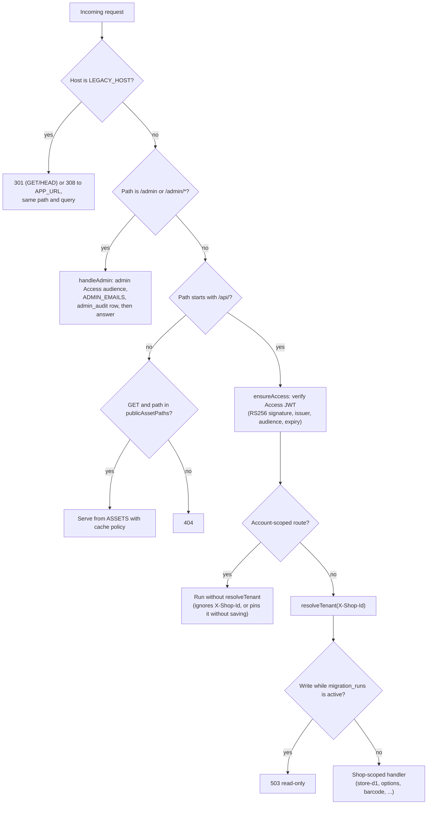
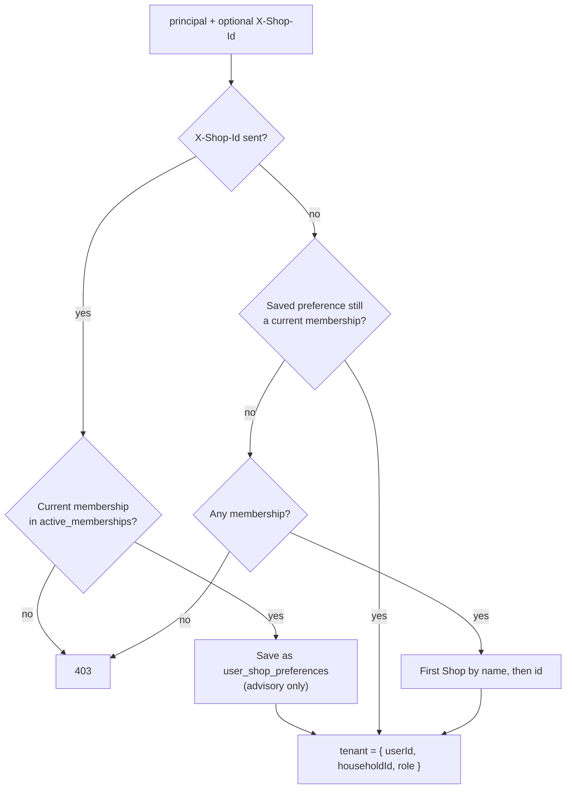

# Request lifecycle (cloud)

Every request enters `handleRequest` in `worker/index.js` (`run_worker_first = true`). The order of the checks below is the order in the code.

## 1. Identity: the Access JWT

- `ensureAccess` returns 503 if `ACCESS_TEAM_DOMAIN` or `ACCESS_AUD` is missing, so production never runs without sign-in.
- The token comes from the `Cf-Access-Jwt-Assertion` header or the `CF_Authorization` cookie. `requireCloudflareAccess` (`lib/shared.js`) checks the RS256 signature against the team's JWKS (cached for one hour), the issuer, the audience and the expiry, and requires `sub` and `email`.
- The result is the **principal**: `{ provider: 'cloudflare_access', subject, email, displayName }`. Nothing the browser sends (email header, body field, role) is used as identity.

## 2. Account-scoped routes (before `resolveTenant`)

These run before tenant resolution because the caller may have no membership yet, or because they act on the account rather than one Shop:

| Route | Why it is account-scoped |
| --- | --- |
| `POST /api/shops` | Creates a new Shop; ignores `X-Shop-Id` and does not change the saved preference |
| `GET, PUT /api/email-preferences` | Settings belong to the person |
| `GET /api/shops/deleted`, `POST /api/shops/:id/restore` | Deleted Shops are hidden from tenant resolution |
| `GET /api/owner/overview`, `GET /api/owner/export` | Cover every Shop the caller owns |
| `GET, POST /api/shop-types[/update, /options, /delete]` | Custom types belong to the Owner, not a Shop |
| `GET /api/shop/onboarding-status`, `POST /api/shop/onboarding` | First sign-in and the one-time bootstrap |
| `GET /api/household/invitations/pending`, `POST /api/household/invitations/:id/accept` | An invited person has no membership yet; both are throttled |

The member-management routes (`.../members/:id/promote|remove|demote|transfer`, `/api/household/export`, `/api/household/delete`, `/api/household/leave`) also run here, but use `pinnedTenant`: `X-Shop-Id` is required, must be a UUID of a current membership, and is **not** saved as the preference.

## 3. Tenant resolution (`resolveTenant`, `lib/tenants.js`)

`active_memberships` is a view over `memberships` that hides Shops with a row in `household_deletions`, so a deleted Shop disappears from every normal lookup at once.

## 4. Shop-scoped handlers

After resolution, every query filters by `tenant.householdId`. Write routes first check `migration_runs`: if that table exists with `state = 'active'`, writes return 503. No migration creates the table; it is an operator switch.

These write routes also require `Content-Type: application/json` and a same-origin request (`Origin` equals the site and `Sec-Fetch-Site` is not `cross-site`): Shop creation, invitation acceptance, email preferences, Shop types, own restore, promote, remove, demote, transfer, delete, leave, and the Shop list edits under `/api/options`. The CSV exports reject `Sec-Fetch-Site: cross-site`. Other routes (for example batch writes and invitation creation) rely on the Access session and tenant checks. Errors are returned as `{ error }` JSON with the status from the thrown error, plus `current` on a 409 revision conflict and `Retry-After` on a 429.

## 5. Static files and cache policy

Only GET requests for paths in `publicAssetPaths` (`lib/shared.js`) are served; everything else is 404. `assetCacheControl` then sets:

| Path | Cache-Control |
| --- | --- |
| `/index.html` (and `/`) | `no-store` |
| Paths in `bootstrapAssetPaths` (`worker/index.js`) | `no-cache, must-revalidate` |
| Images | `public, max-age=31536000, immutable` |

The service worker (`public/sw.js`) never handles `/api/`, `/admin/` or `/cdn-cgi/` requests or any non-GET request, and never caches a redirected response (an Access login page).

## 6. Admin requests

`handleAdmin` uses a separate Access audience (`ADMIN_ACCESS_AUD`) and the `ADMIN_EMAILS` allowlist. Every authorized read writes an `admin_audit` row before data is returned; if that insert fails, the request is refused with 503. See [security.md](security.md#admin-console).
