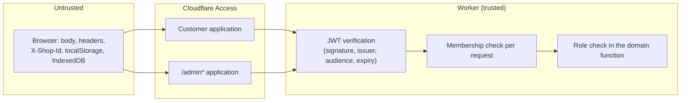

# Security model

## Trust boundaries

- **Identity** comes only from the verified Access JWT (`requireCloudflareAccess`). An identity is the pair `(provider, subject)`; email is used to match invitations, never to link accounts or take over ownership.
- **Shop access** is rechecked on every request against `active_memberships`. `X-Shop-Id` only chooses among the caller's own memberships; an unknown or foreign id is 403.
- **Role** is read from the database inside each domain function, not from the request.

## Roles

| Capability | Member | Owner |
| --- | --- | --- |
| Use inventory (list, add, edit, consume, discard, photos, barcode, notifications, push) | Yes | Yes |
| Export the current Shop as CSV | Yes | Yes |
| Leave the Shop | Yes | Yes, unless the last Owner |
| See the member list and pending invitations (`GET /api/household/access`) | No | Yes |
| Invite (as Member or Owner), revoke invitations | No | Yes |
| Promote, demote, transfer ownership, remove a Member | No | Yes |
| Change the Shop type, edit the Shop's dropdown lists | No | Yes |
| Delete the Shop (flag-gated), restore it within the keep period | No | Yes |
| Owner overview across Shops, custom Shop types | No | Yes (only Shops they own; only types they made) |

Invariants enforced in SQL (guarded inserts and triggers, not only in JavaScript):

- A Shop always keeps at least one Owner (demotion needs two Owners; the last Owner cannot leave).
- Owners cannot be removed, only demoted first.
- A person owns at most 5 Shops and belongs to at most 50; one new Shop per 24 hours.
- An Owner cannot delete their only Shop.

Every structural change writes an `access_audit` event in the same D1 batch as the change, and uses an operation-id receipt so a retry cannot apply twice.

## Request hardening

- Most account and membership writes require `Content-Type: application/json`, a matching `Origin` and `Sec-Fetch-Site` not `cross-site` (see [request-lifecycle.md](request-lifecycle.md#4-shop-scoped-handlers)).
- Invitation discovery and acceptance are throttled per hashed principal and per hashed client IP; the change feed per hashed principal. Over the limit returns 429 with `Retry-After`. If the throttle table is missing, the request fails closed.
- JSON bodies over 3 MB are rejected; photos must be JPEG, PNG or WebP up to 2 MB and their bytes must match the type.
- Push endpoints must be https (http only for localhost).
- CSV exports neutralize spreadsheet formulas in cells.
- Responses from the API are `no-store`; `index.html` is `no-store`.

## Admin console

- Separate Access application for `/admin*` with its own audience (`ADMIN_ACCESS_AUD`); a customer token fails the audience check. The email must also be in `ADMIN_EMAILS`. Missing configuration returns 503.
- Every authorized request writes an `admin_audit` row before data is returned; if the audit insert fails, the request is refused.
- Responses carry a strict Content-Security-Policy (`default-src 'self'`, no framing), `X-Frame-Options: DENY`, `nosniff` and `no-referrer`.
- **Privacy:** admin views show Shop names, member and invitation emails, roles, counts, audit events, outbox status, flags, Shop types and list configuration. They never return item names, notes, photos or push subscription details. `test/admin-console.test.js` seeds secret item values and checks they never appear.
- Writes need `ADMIN_WRITES_ENABLED=true`, an `X-Admin-Action: 1` header, same origin, an operation id and a 10 to 500 character reason. They are rate-limited to 30 per admin per minute.

## Secrets and data handling

- Secrets live in Cloudflare (Wrangler secrets) or ignored local files (`data/gemini.key`, `data/vapid.json`, `.env`). `wrangler.toml` holds only names, ids and public variables.
- `INITIAL_OWNER_EMAILS` is never returned by any endpoint.
- Emails contain no item data and no invitation tokens; the invitee must sign in with the invited address.
- The service worker shows a generic push message, because it has no Shop context.
- Local mode has no sign-in and binds to `127.0.0.1` by default; binding it to another address is unsafe without external access control.
